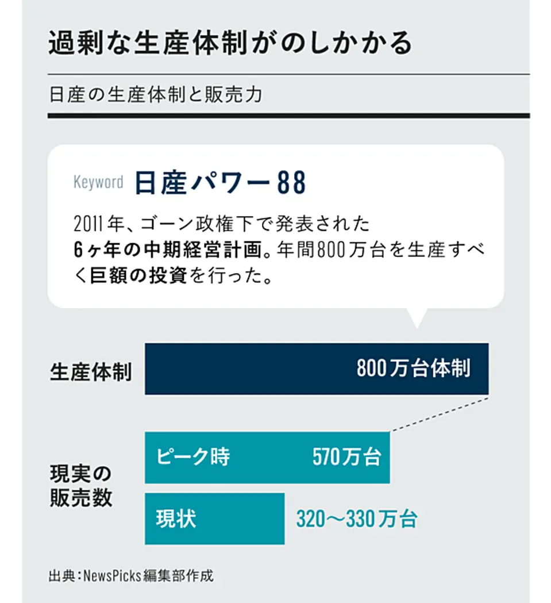
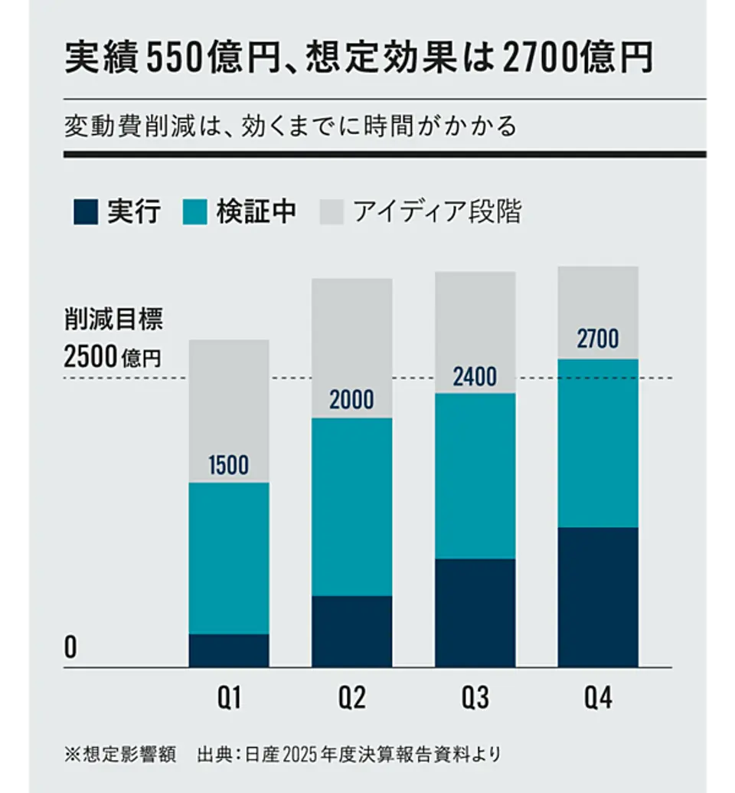
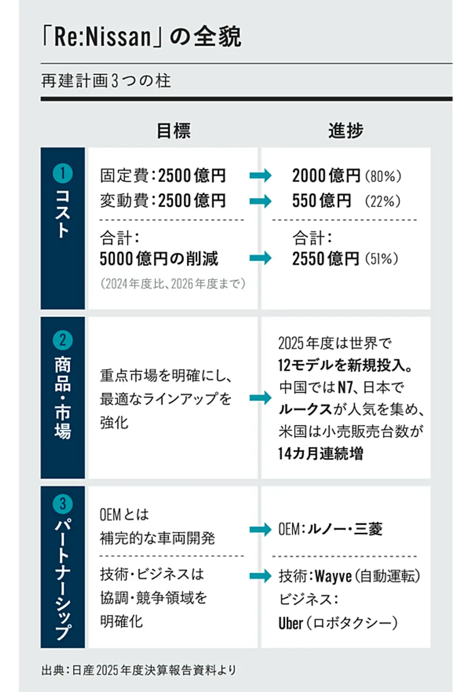

# 現場と数字で日産を読む
## ―― SoyとOpusの対話【全面改訂版】

---

### まえがき

本書は、二〇二六年の春、埼玉日産のディーラー店頭から始まった、ひとりの個人投資家（Soy）と、ひとつの対話型AI（Opus）による日産自動車をめぐる対話の記録である。

初版は、新型エルグランドの受注が積み上がり始めた頃の「読み解き」だった。その後、月次の生産・販売実績が毎月積み重なり、CEOの単独インタビューがあり、そして二〇二六年八月三日、第一四半期決算が発表された。推定は実績に置き換わり、いくつかの読みは裏付けられ、いくつかは修正を迫られた。

この全面改訂版は、二〇二六年八月五日時点の確定情報で本文を書き直したものである。初版から積み重なった補論と追記は、すべて本文に溶かし込み、章立ても組み直した。「予想し、後から答え合わせをした」という時系列の痕跡は、方法論として意味のあるものだけを残し、それ以外は現在形に統一している。

この対話には、二つの視点が同居している。ひとつは、現場で実車を確かめ、見積書を読み、ディーラーと交渉する、生活者としての視点。もうひとつは、決算資料の数字を分解し、開示されない固定費を逆算し、会社計画の妥当性を検算する、投資家としての視点。Soyはその両方を行き来する。

本書が扱うのは、主に三つの上場企業である。日産自動車（七二〇一）、日産車体（七二二二）、日産東京販売ホールディングス（八二九一）。同じ「日産」の名を持ちながら、性格はまるで違う。本体は再建の渦中から黒字転換へ、車体は高単価車を作る子会社として静かに稼ぎ、東京販売は地場の販社として独自の道を歩む。

なお、断っておかなければならないことがある。本書は投資を推奨するものではない。ここに書かれた数字には、開示情報からの逆算や推定が含まれ、Soyの結論も一個人の判断である。読者には、本書を「ひとつの読み解きの実例」として、自分の頭で考える材料にしていただきたい。

---

### 目次

まえがき

第一章　二つの受注 ―― 現場から始まった推論
第二章　供給の天井 ―― 月二千台の算数
第三章　十七を十にする ―― Re:Nissan、固定費の解体
第四章　一台あたり七十万円 ―― 開示されない数字を逆算する
第五章　三つの上場会社 ―― 本体・車体・販社の見分け方
第六章　ミックスという一本道 ―― 台数を増やさず、濃くする
第七章　関税の算数 ―― 二千八百六十億円に耐えた黒字
第八章　中国という別勘定 ―― 持分法と、三か月遅れの数字
第九章　第一四半期決算を読む ―― 台数減で増収の正体
第十章　エスピノーサの再定義 ―― 四つのモデル群と顧客への回帰
第十一章　技術の現在地 ―― e-POWER、SDV、そしてWayve
終章　階段を登り始めた会社

あとがき

---

## 第一章　二つの受注 ―― 現場から始まった推論

### エルグランド八千台、キックス一万一千台

**Soy**　この対話は、埼玉日産の三郷店で、新型エルグランドの受注がすごいことになっている、と聞いたところから始まりました。あれから受注は積み上がり続けて、第一四半期決算の時点で公式に数字が出ています。

**Opus**　ええ。会社発表で、**エルグランドの受注は八千台超、キックスは一万一千台超**。エルグランドは受注開始が五月二十八日、発売が七月十六日。展示車も試乗車もない期間に、月販目標千九百台の四倍以上の受注残を積んだことになります。キックスは六月十八日発売で、こちらは発売から一か月半で一万一千台。どちらも、実車を見るというプロセスを飛ばして「買おうと思って待っていた人」が一斉に動いた数字です。

**Soy**　エルグランドは、受注の半分が上級グレードなんですよね。

**Opus**　そこが需要の質を物語っています。VIP（八百六十九・八万円）やAUTECH系（八百二十四・七万円）といった上級が半分を占める。値引きなしで売れているだけでなく、客が自ら高いグレードを選んでいる。価格にほとんど反応しない需要——経済学で言う「価格弾力性の低い需要」です。背景には、アルファード／ヴェルファイアが納期長期化と受注停止で「買いたくても買えない」状態が続き、その行き場を失った需要——いわば「アルヴェル難民」——がエルグランドに流れ込んでいる、という構図があります。

**Soy**　キックスの方は、性格が違う。

**Opus**　キックスはエントリーの「Xシンプルパッケージ」が二百九十九万九千七百円。三百万円をあえて切って、カローラクロスやヴェゼルの激戦区に真正面から挑む価格です。売れ筋はXとe-4ORCE。つまり、こちらは「新技術（第三世代e-POWER）を量販価格で試したい」という実需です。高単価のエルグランドと、量販のキックス。**性格の違う二つの需要が、同じ時期に、同時に現物で確かめられた**。これが二〇二六年夏の日産の姿です。

**Soy**　販売実績も、ついに反転しましたね。

**Opus**　二十カ月連続で減っていた販売台数が、二〇二六年度第一四半期でプラスに転じました。六月度の国内販売（軽含む）は前年同月比プラス六・五％。牽引したのは軽のルークス（販売プラス五十二％）で、エルグランド・キックスの受注残が販売実績に計上されるのはこれから——受注（先行指標）と販売実績（遅行指標）のあいだには二〜三か月のずれがあります。つまり、反転の第一波が軽で、第二波の新型車はまだ数字に乗っていない。

### なぜ、この会社を見るのか

**Soy**　私の投資の枠組みでは、日産は「PSRのサテライト」という位置づけです。安定して配当を出す高配当のコアを複数持って、その土台の上に、PSR的な値上がり狙いのサテライトを置く。日産はそのサテライトの中核です。

**Opus**　PSR——株価売上高倍率。フィリップ・フィッシャーとその息子ケネス・フィッシャーが重視した指標で、「今は利益が出ていないが、売上を維持しながら利益率が改善すれば化ける」会社を、売上ベースで安く拾う発想です。日産はまさにその対象です。売上十二兆円の規模を持ちながら、FY二〇二五の営業利益率は〇・五％。利益で見れば買えない。でも、売上は大きい。この売上から業界並みの利益が出るようになったら——という賭けです。

**Soy**　もう一つ、私は本間宗久も意識しています。「人の行く裏に道あり花の山」。みんなが日産はダメだと言っているときに、現場で確かめて、数字で詰めて、本当はどうなのかを見る。

**Opus**　それが本書のスタンスです。世間の評判に流されず、ディーラーで受注を確かめ、決算資料の数字を逆算する。フィッシャーのPSRと、本間宗久の逆張りの精神。この二つが、本書の背骨です。そして日産は配当ゼロですから、配当を出すコアが別にあって初めて、無配のサテライトを安心して持てる。本体への投資はキャピタル狙い、インカムは別で取る——この役割分担は、本書の結論の一つでもあります。

---

> **【解説】PSR（株価売上高倍率）という物差し**
>
> 株式の割安・割高を測る最も一般的な指標はPER（株価収益率）だが、利益が赤字の会社では機能しない。そこでフィッシャー父子が重視したのがPSR（株価÷一株あたり売上高）である。売上は利益ほど大きく振れず、赤字の会社にも売上はある。
>
> PSRの思想はこうだ。「現在は利益率が異常に低い。しかし売上の規模は大きい。もしこの会社が業界並みの利益率を回復したら、どれだけの利益が出るか」。その潜在的な利益力を売上を基準に見積もり、株価が割安なら拾う。
>
> 日産はこの発想にうってつけの対象である。本書の数字の分解は、すべて「利益率は改善するか」という一点を検証するためのものだと言ってよい。

---

### 月六万七千二百円という現場の数字

**Soy**　エルグランドは、実際に見積もりも取りました。総額八百四十七万円、Gグレードの四駆・寒冷地仕様。それで残価設定クレジットの月々が、六万七千二百円だったんです。

**Opus**　八百万円級の車が月七万円弱。からくりは残価です。見積書では車両ベース約五百九十七万に対して残価が三百三十五万。残価が高いほど月々は劇的に下がる。そして「エルグランドの中古価値が高い」という市場の読みが、そのまま月々の安さに変換されている。残価が高い→月々が安い→売れる→中古相場が高止まりする→さらに残価を高く設定できる。発売前からこのループが回り始めている。「買えないアルファードを待つ」か「エルグランドに乗り換えて月七万弱」か——需要を焚きつけているのは、この差額です。

---

> **【解説】残価設定クレジットと、需要のつくられ方**
>
> 残価設定クレジットとは、車両価格から数年後の予想下取り価格（残価）を差し引き、残りだけを分割で支払うローンである。中古価値が高く維持されると見込まれる車ほど残価を高く設定でき、月々の支払いは下がる。
>
> これは値引きではない。メーカーは一台あたりの利益を削らずに、「将来の中古価値」を担保にして需要を焚きつけている。ただし残価は設定側の約束であり、将来中古相場が想定を下回れば差損は設定側が被る。ブーム一巡後の残価設定は、中長期では注視すべき点である。

---

## 第二章　供給の天井 ―― 月二千台の算数

### 作れるのは、月二千台

**Soy**　受注がいくら積み上がっても、作れる数には上限があります。

**Opus**　エルグランドを作っているのは「日産車体九州」——日産本体ではなく、上場子会社・日産車体の工場です。年間十二万台ほどの能力を持ちますが、約八割は輸出向けの高級SUV——中東向けパトロール、北米向けアルマーダ、インフィニティQX80——で埋まっている。国内向けエルグランドに割ける枠は、**月二千台、年二万四千台**。これが供給の天井です。

**Soy**　しかも、ボトルネックは一か所じゃない。

**Opus**　二層構造です。エルグランドの心臓部——第三世代e-POWERの「5-in-1」ユニット（モーター、インバーター、減速機、発電機、増速機の一体化）——は横浜工場で作られる。完成車は九州、心臓は横浜。しかもこのユニットは、キックス、欧州キャシュカイ、北米の新型ローグも積む。横浜の生産能力が、日産の電動化戦略全体の制約条件なんです。

**Soy**　月二千台という天井は、二つの経路で裏が取れています。

**Opus**　一つは納期。受注残八千台を月二千台で割ると、ちょうど四か月分。現場で聞いた「納期三〜四か月」と、ぴたりと合う。もう一つは月販目標との関係です。会社の月販目標は千九百台。**天井の二千台と、ほとんど差がない**。エルグランドは目標をほぼ能力いっぱいに置いた車で、上振れの余地が構造的にない。

**Soy**　だから、受注が八千台でも一万台でも、年間の利益は変わらない。

**Opus**　変わるのは「その利益が何か月先まで確定しているか」だけ。**受注残は、売上の先食いではなく、利益の確度の担保**として読むべき数字です。この区別が、初動の数字に興奮しないための、いちばん大事な線引きになる。かつての内田体制は、コロナの品薄という追い風を実力と取り違えました。投資家側が、エルグランドの初動で同じ轍を踏んではいけない。

### 利益の主役、台数の脇役

**Soy**　では、エルグランドはいくら稼ぐのか。

**Opus**　実勢価格は主力Gグレードで乗り出し八百五十万から九百五十万。平均八百万円、年二万四千台、限界利益率二〇％とすると——**年三百八十億円規模の限界利益**です。旧型エルグランドは十五年もモデルチェンジされず、月四十二台、年間の限界利益は約十二億円まで落ちていた。新型はその三十倍超を稼ぐ。死にかけていたモデルが、いきなり主力級の稼ぎ頭に化けた。

**Soy**　でも、台数で見ると話が逆になる。

**Opus**　年二万四千台は、日産の連結販売——約二百五十万台（中国を除く）の中では、わずか一％ほど。台数の屋台骨は北米の量販車です。ローグだけで年二十二万台。つまりエルグランドは、**利益の主役で、台数の脇役**。この二つを分けて考えることが決定的に重要です。日産の商品ラッシュは「台数を爆発させる」ためではなく、高単価の新型で「一台あたりの利益を濃くする」ためのものです。

**Soy**　グレード構成も、それを支えている。

**Opus**　エルグランドは最安のXでも六百八十九万七千円、全車e-POWER＋e-4ORCE。どのグレードが売れても、一台あたりの限界利益は全社平均七十万円の二倍以上——百六十万円規模になる。台数では全体の一％でも、一台ごとが濃いから、全社のミックスを押し上げる力を持つ。これがエルグランドという車の、収益上の正体です。

## 第三章　十七を十にする ―― Re:Nissan、固定費の解体

### 八百万台体制という遺構

**Soy**　なぜ日産の固定費は、こんなに重いのか。エスピノーサCEOが、根本原因をはっきり語っています。

**Opus**　「二〇一六年か一七年頃から、少し間違った方向に行き始めた。販売台数を追い過ぎた」——CEOの言葉です。ゴーン体制下の二〇一一年に発表された六か年中期計画「日産パワー88」で、**年間八百万台を生産すべく巨額の投資**を行った。結果、販売はピークでも五百七十万台、現在は三百二十〜三百三十万台。生産設備だけが八百万台体制のまま置き去りにされ、その固定費が今の重しになっている。

**Soy**　工場には、莫大な固定費がかかる。

**Opus**　建物、設備、人件費、減価償却。これらは一台作ろうが百万台作ろうがほぼ一定でかかる。稼働率の低い工場は、固定費を回収できずに損益分岐点を押し上げる。だからRe:Nissanは、世界の車両工場を十七から十に減らし、中国を除く生産能力を三百五十万台から二百五十万台へ絞る。**損益分岐点を三百十万台から二百五十万台へ引き下げる**——これが工場再編のいちばんの狙いです。

**Soy**　閉鎖の七拠点は。

**Opus**　アルゼンチン、インド、追浜（神奈川）、日産車体湘南（神奈川）、メキシコのシバックとCOMPAS、南アフリカのロスリン。湘南が二〇二六年度末、追浜が二〇二七年度末で生産終了。追浜はリーフを生産してきた日産EVの発祥の地の一つで、象徴的に重い決断ですが、稼働率が五割を切っていた以上、収益構造の観点では合理的な選択です。追浜のリーフは栃木へ移管され、栃木の遊休を埋める。閉鎖と集約は表裏一体なんです。

**Soy**　重要なのは、この閉鎖がまだ完了していないこと。

**Opus**　そうです。固定費が実際に消えるのはこれから。現在の損益分岐点は約二百六十四万台で、目標の二百五十万台まで、まだ下げ代がある。**今見えている回復は、途中経過**です。追浜・湘南の固定費が抜ければ、同じ台数でも利益はもう一段上がる。これがRe:Nissanの「再建から成長へ」というフェーズ移行の利益ドライバーです。

### コスト削減、五千億の現在地

**Soy**　削減の進捗を、数字で押さえておきましょう。

**Opus**　目標は二〇二四年度比・二〇二六年度までに**固定費二千五百億＋変動費二千五百億＝五千億円**。FY二〇二五末時点の実行済みは、固定費二千億（進捗八〇％）、変動費五百五十億（二二％）の計二千五百五十億（五一％）。そして第一四半期にさらに六百億超を積み、**累計三千百五十億円**まで来ています。固定費が前倒し、変動費がこれから、という非対称な形です。

**Soy**　固定費の二千億のうち、半分は減損由来なんですよね。

**Opus**　誠実に見るべき点です。約半分は「減損損失を計上した資産の、その後の減価償却費が消えた分」——会計上の償却減が源泉で、残り半分が人件費・調達・工場再編といった現金コストの削減。償却減も損益上の固定費としては消えるので損益分岐点は下がりますが、「利益を作る力」と「現金を生む力」は分けて評価する必要があります。

**Soy**　変動費の方は、時間がかかる理由が構造的です。

**Opus**　CEOが「大部屋方式」を説明しています。エンジニアリング・購買・物流・製造・商品企画・デザイナーを部署横断で一つの部屋に集め、「クルマの競争力を損なわずにコストを下げるアイデアを見つけること」だけを目的にする。アイデアを設計変更に落とし、サプライヤーと調整し、新部品の車が生産・販売されて、初めて損益に効く。FY二〇二五の五百五十億は年度途中から順次立ち上がった施策の累計で、**FY二〇二六は同じ施策が年初からまる十二か月効く**。通年効果だけで五百五十億を上回り、そこに新規アイデアが乗る。パイプラインで見ると、検証中・アイディア段階まで含めた想定効果は二千七百億まで積み上がっています。

**Soy**　残る十拠点と、栃木の宿題も整理しておきましょう。

**Opus**　国内は横浜（エンジン・e-POWER）、九州（本体と車体、完成車の主力）、栃木（Z、GT-R、アリア、リーフ）。海外はサンダーランド、スメルナ、キャントン、アグアスカリエンテス、タイ、ブラジル。課題は稼働率四割の栃木です。埋める候補は、追浜から来るリーフ、噂される次期GT-R（ハイブリッド）、二〇二八年の全固体電池EV、そして新型スカイライン——Zと同じVR30DT・同じプラットフォームなら、Zを作る栃木で作るのが合理的です。栃木の遊休が解消すれば、固定費の回収が進み、損益分岐点がさらに下がる。**栃木の稼働率は、再建の隠れた最重要指標**です。

---

> **【解説】損益分岐点台数という考え方**
>
> 自動車メーカーの利益は、おおまかに次の式で決まる。
>
> 　営業利益 ＝（一台あたり限界利益 × 販売台数）− 固定費
>
> 「一台あたり限界利益」とは、売価から材料費や部品代といった変動費を引いた一台ごとの儲け。固定費を一台あたり限界利益で割った台数が「損益分岐点台数」であり、これを超えた分は一台ごとの限界利益がまるごと営業利益に積み上がる。
>
> 損益分岐点付近にいる会社は、わずかな台数増やコスト削減で利益が大きく動く（操業レバレッジ）。日産がまさにこの状態にある。Re:Nissanの「十七を十に」は、このレバレッジを効かせるための構造改革である。

---

## 第四章　一台あたり七十万円 ―― 開示されない数字を逆算する

### 三つの経路が、同じ答えに着く

**Soy**　トヨタの決算説明会を見て、自動車は「一台あたりの限界利益」と「損益分岐点台数」で考えるんだ、と開眼したのが、この章の原点でした。

**Opus**　その枠組みを日産に当てはめると、問いが立ちます。日産は「損益分岐点二百五十万台」と公言している。ならば、固定費を二百五十万で割れば、会社が前提に置く「一台あたり限界利益」が逆算できるはずだ、と。削減後の自動車事業の固定費を約一兆七千億円と置くと——**一台あたり限界利益は約七十万円**。

**Soy**　別の経路でも検算できた。

**Opus**　日産は「三百五十万台で営業利益率四％」とも公言しています。三百五十万台は損益分岐点を百万台超過し、その超過分の限界利益がまるごと営業利益になる。この関係から逆算しても七十万円前後に収束する。さらに決定打が、有価証券報告書です。**連結売上台数二百四十三・五万台と自動車事業の営業損失▲二千三百九十九億円で検算すると、一台あたり限界利益は六十九・七万円**。本書の七十万円と、誤差〇・五％で一致した。固定費経路、利益率経路、有報経路——独立した三つの窓から見て、同じ答えに着いたわけです。

**Soy**　率にすると一六％。業界目安の二〇〜三〇％を下回る。

**Opus**　最初は業界目安に引っ張られて補正したくなる数字ですが、営業利益率〇・五％の会社が限界利益率だけ業界並み、というのはむしろ不自然です。一六％という低さこそが、営業赤字すれすれの現実と整合する。低い理由は構成——軽自動車や新興国向けの安いモデルに偏ったミックスです。そして、それは裏を返せば**伸びしろ**。一六％を業界水準へ上げる余地の大きさが、日産の利益回復の本質です。

**Soy**　為替感応度からも裏が取れる。

**Opus**　会社開示の感応度は一円の円安で営業利益約百二十億円。為替の影響は「輸出台数×為替変動×一台あたりの外貨建て利幅」で効くので、ここからも一台あたりの利幅の桁が確かめられる。複数の窓から同じ対象を見て、整合するレンジを絞り込む——開示されない数字に迫る、誠実な方法です。

---

> **【解説】開示されない数字を、逆算する**
>
> IFRSや連結中心の開示では、売上原価のうちどれだけが変動費でどれだけが固定費かは直接見えない。しかし、会社が公言する別の数字——損益分岐点台数、台数と利益率の目標、為替感応度——を手がかりに、逆算はできる。
>
> 重要なのは、推定値を一つの数字に固執させず、複数の経路で検算し、レンジで捉えること。そして業界の常識的な水準と照合して不自然でないかを確かめること。本書の一台あたり七十万円は、この「三角測量」の実践例であり、後に有報の実績値（六十九・七万円）で裏付けられた。

---

## 第五章　三つの上場会社 ―― 本体・車体・販社の見分け方

### 同じ「日産」、違う性格

**Soy**　日産と名の付く上場会社は三つあります。本体（七二〇一）、日産車体（七二二二）、日産東京販売HD（八二九一）。

**Opus**　性格はまるで違います。**車体**は売上の九八％が日産向けの製造子会社で、親会社が八八％を保有。作っているのは九州のQX80（一台あたり限界利益は全社平均の三・五倍）、パトロール・アルマーダ（二・六倍）、エルグランド（二・四倍）——日産グループで最も濃いミックスの集積地です。現金約八百七十億円を持つ現金リッチな会社でもある。

**Soy**　でも、投資対象としては難しい。

**Opus**　利益が出ても、その処分は親会社の都合で決まる。配当は抑えられ、株価は割安に放置されやすい——典型的なバリュートラップの構造です。だから本書の結論は、「車体は投資対象というより、**本体の実態を映す鏡**」。車体の業績は本体の生産・販売の実態をほぼ純粋に映すので、赤字や再建費用でノイズの多い本体決算を、クリーンに検証する道具になる。

**Soy**　東京販売は。

**Opus**　独立系の販社で、DOE（純資産配当率）を導入した自律的な株主還元が特徴です。直近は新車のモデル末期の谷で減収減益（FY二〇二六実績：売上千二百九十億、営業益四十七億）でしたが、FY二〇二七計画は純益三十五億へ三割回復を見込む。エルグランドが値引きなしで売れる局面では、車両マージンに加えてオプション、メンテナンスパック、残価クレジットの手数料まで取れる。製販分離の「販」側として、高単価車ブームの恩恵を別の形で受けます。

**Soy**　役割分担で言うと。

**Opus**　**投資するなら本体（キャピタル）と東京販売（インカム）。車体は分析の鏡**。エルグランドのヒットの果実——第三世代e-POWERの心臓部を作る横浜、完成車の利益配分、ブランド——が最も集まるのは本体です。果実が集まる側で持つ。これが三社を見極めた上での結論です。

---

> **【解説】親子上場と、バリュートラップ**
>
> 親会社と子会社がともに上場する「親子上場」では、子会社の経営は実質的に親会社に握られる。財務指標がどれほど魅力的でも、それを是正する内部の力（物言う株主、自律的な還元）が働かなければ、割安は解消されない。これが「バリュートラップ（割安の罠）」である。
>
> 同じグループでも、ガバナンス構造が違えば投資価値はまるで違う。数字の裏にある「誰が意思決定を握っているか」を読むことの重要性を、日産三社の対比は教えてくれる。

---

## 第六章　ミックスという一本道 ―― 台数を増やさず、濃くする

### 台数の道は、三重に封じられている

**Soy**　利益を回復する道は、台数を増やすか、一台あたりを濃くするか。

**Opus**　日産に台数の道はありません。三つの壁があります。生産能力の壁——Re:Nissanで能力を三百五十万から二百五十万台へ削減中。市場の壁——世界の新車市場が弱含み。収益性の壁——仮に台数を増やせても、値引きで増やせば、ただでさえ業界を下回る限界利益率がさらに下がる。だから、残された道はミックス改善だけ。そして、それは消去法であると同時に、積極戦略でもある。エルグランドの受注、第三世代e-POWERという単価を上げられる技術、日産車体九州という高単価車を作れる工場——強みが噛み合う一本道です。

**Soy**　効果を数字で。

**Opus**　限界利益率を一六％から一ポイント上げるだけで、限界利益は約千億円増える。二ポイントで約二千百億円。固定費が一定なら、それがまるごと営業利益に乗る。**会社計画の営業利益二千億円は、率を二ポイント上げれば届く計算**です。

**Soy**　その担い手が、三つの震源。

**Opus**　一つ目が日産車体九州の高単価車群。二つ目が北米ローグのe-POWER化——北米最量販の年二十二万台の主力が、現行ガソリン約二・九万ドルからe-POWER版三・三〜三・六万ドルへ、一台あたり六十万から百万円の単価上昇。三割から五割がe-POWER化すれば、寄与は年二百七十億から四百五十億円規模。三つ目が新型キックスと第三世代e-POWERの展開全般——こちらは単価より、量販価格帯への普及と台数で効く。エルグランドが単価で効くなら、キックスは台数で効く。

**Soy**　エルグランド単体の寄与は。

**Opus**　全社平均七十万円との差は九十万円。年二万四千台が平均的な車を置き換えるなら、九十万かける二万四千で**約二百十六億円**。台数は全体の一％なのに、構成が高単価側にシフトするだけでこれだけ乗る。これがミックス改善の算数です。

### インセンティブとの綱引き

**Soy**　ただし、ミックス改善には天敵がいる。

**Opus**　販売奨励金——実質値引きです。FY二〇二五の対前年ブリッジで「販売パフォーマンス」は**▲三百五十億**でした。中身を分解すると、構成改善（ミックス）はプラス千百四十三億も稼いでいたのに、台当たり奨励金と価格改定が▲千百七十四億——うち米国だけで▲八百七十九億——それを食い潰していた。ミックス改善のエンジンは動いていたのに、値引きで削られて、正味はマイナスだった。旧型ラインナップで戦っていた年の現実です。

**Soy**　それが、反転した。

**Opus**　FY二〇二六第一四半期の販売パフォーマンスは**プラス二百三十七億**。価格改定と販売費のプラスが原材料高の一部を補った、と会社は説明しています。新型車が値引きなしで売れる——エルグランドとキックスの受注の質——が、ブリッジの上でも見え始めた。**ミックス改善が奨励金増を上回る局面への転換**。ここが今期の最重要監視ポイントであり、通期計画の販売パフォーマンス「プラス千五百五十億」の成否を決めます。

## 第七章　関税の算数 ―― 二千八百六十億円に耐えた黒字

### 関税がなければ三千億超

**Soy**　FY二〇二五の日産を語るのに、関税は避けて通れません。

**Opus**　米国は二〇二五年に自動車関税を二十七・五％へ引き上げ、九月の日米合意で十五％に落ち着きました。日産のFY二〇二五の関税負担は、期初見通し最大四千五百億から縮んで、**実績二千八百六十億円**。それでも営業利益五百八十億の黒字を守り切った。エスピノーサCEOの言葉を借りれば——「昨年度、日産は二千八百六十億円のトランプ関税に耐え、営業黒字を守り切った。**関税がなければ営業利益は三千億円を超えていた計算だ**」。

**Soy**　FY二〇二六も、同じ構造が続く。

**Opus**　今期の関税負担は約二千五百億円の前提。つまり営業利益二千億円の計画は、関税を戻せば実力四千五百億相当の「表の顔」です。そして負担の中身は二重構造になっている。**日本発の対米輸出は十五％、メキシコ発は二十五％**。エントリーモデルはメキシコ生産を維持していて、関税コストは一台最大四十九万円。安い車の値付けでこれは限界利益を丸ごと吹き飛ばしうる水準なので、対応は値上げではなく、調達・工程で吸収する方向に振り切っています。

**Soy**　生産地図も動いている。

**Opus**　月次の生産実績にはっきり出ています。米国生産は前年比四割増の月もある一方、メキシコ生産は二〜三割減——量販車を米国内へ移すシフトです。同時に、日本からの北米向け輸出は倍増に近い月がある。中身は日産車体九州のアルマーダやQX80といった高単価SUVで、十五％を払ってもなお限界利益で効く車を、日本から積極的に出している。**関税で量販車は現地生産へ、高単価SUVは日本から輸出**という棲み分けです。第一四半期のブリッジでは、米国関税は前年比プラス百八十三億の増益要因（負担軽減分）として現れ、一過性のプラス三百二十億の中にも関税関連六百十億が含まれています。

---

> **【解説】関税と現地生産（ローカライゼーション）**
>
> 販売する国の中で生産すれば関税はかからない。現地生産シフトは、関税コストの回避と同時に、現地工場の稼働率を高めて固定費回収を進める効果を持つ。
>
> ただし移行には時間がかかる。ローグe-POWERは当初日本で生産し、後にスメルナへ移管する計画で、移管完了までは十五％を払い続ける。関税率一五％は「恒常的なコスト」として残り、各社はそれを前提にした生産体制を構築している。地政学が、企業の生産地図と収益構造をリアルタイムで書き換えている。

---

## 第八章　中国という別勘定 ―― 持分法と、三か月遅れの数字

### 営業利益には乗らない

**Soy**　中国は、会計上、特殊な扱いです。

**Opus**　日産の中国事業（東風汽車有限公司）は日産五〇％・東風五〇％の合弁で、支配していないため連結しません。**DFLの売上も営業利益も、日産のP/Lには一円も乗らない**。乗るのは「DFLの税引後損益×五〇％」が営業外の持分法投資損益に一行だけ。だから本書で使う「二百五十万台」という台数も、中国を除いた連結ベースなんです。

**Soy**　その持分法が、悪化している。

**Opus**　FY二〇二四のプラス九百十三億円から、FY二〇二五は**マイナス二十六億円**へ。営業利益二千億に対して純利益二百億という会社計画の、大きな差の源泉の一つがここです。中国の不振は、営業利益ではなく純利益を削る。**営業利益の回復と純利益の回復に時間差がある**理由が、この会計構造にある。

### 決算の中国は、三か月前を見ている

**Soy**　ここに、月次速報と決算を突き合わせないと見えない罠があります。

**Opus**　第一四半期決算の中国販売は十三万三十四台。ところが月次速報の四〜六月を足すと十万七千四百二十四台で、二万二千六百十台も合わない。答えは脚注にあります——**「中国小売販売台数は暦年ベース」**。決算がFY二六Q1として載せている中国は、暦年一〜三月なんです。他の地域はずれません。日本は月次合算と決算が**一台も違わず一致**する。ずれるのは中国だけ。

**Soy**　これの含意は重い。

**Opus**　中国の暦年一〜三月はプラス七・二％——Nシリーズの新型車が支えた数字です。ところが四〜六月はマイナス三十二％。つまり、**四〜六月の急減速は、まだ第一四半期決算に入っていない**。Q1の持分法投資損失が二十五億円と軽く見えるのも、中国がまだプラス成長だった時期を映しているから。急減速が損益に現れるのは第二四半期からで、持分法損失は一段深くなる可能性が高い。**中国に関する限り、月次速報は決算の約三か月先を走る先行指標**です。

**Soy**　絶対値は厳しいが、相対では。

**Opus**　暦年上期は市場全体がマイナス二十二％の中で日産はマイナス十五％、市場シェアはわずかに拡大しました。新エネルギー車——N6、N7、NX8、フロンティアプロ——には勢いがあり、七月からは中国国外への輸出も始まった。「中国で設計・生産し、世界に売る」構想が船積みの段階に入っています。ただし会社は中国の市場環境を反映して販売台数見通しを下方修正した。**台数を下げても利益計画二千億は据え置いた**——中国の回復を当て込まずに利益を作る、という判断です。中国の詳細は、姉妹編「スティーブン・マーと中国日産」に譲ります。

## 第九章　第一四半期決算を読む ―― 台数減で増収の正体

### 数字の全体像

**Soy**　二〇二六年八月三日、第一四半期決算が出ました。まず全体像を。

**Opus**　**売上高二兆九千六百四十二億円（前年同期比プラス九・五％）、営業利益七百七十九億円、経常利益四百九十一億円、当期純利益三十七億円**。前年同期は営業損失七百九十一億、純損失千百五十八億でしたから、営業利益で千五百七十億円の改善、純利益は黒字転換です。事業別では、**自動車事業が▲八十二億円とほぼ損益均衡**（関税影響込み）、販売金融が八百六十二億円の黒字。自動車事業のネットキャッシュは九千六百九十二億円と一兆円規模を維持しています。

**Soy**　FY二〇二五通期では、販売金融の黒字が自動車事業の▲二千四百億を覆って、辛うじて五百八十億の黒字でした。

**Opus**　その構造自体は続いていますが、決定的に違うのは、**覆われる側の穴が四半期八十二億まで縮んだ**こと。売上総利益率は八・七％から十五・八％へ、七・一ポイントの改善。原価構造そのものが一段変わった数字です。

**Soy**　ブリッジは。

**Opus**　前年同期▲七百九十一億から七百七十九億への千五百七十億の改善。内訳は、**モノづくりプラス八百二十億**（大部屋方式の変動費削減）、**為替プラス三百五十億**、**一過性プラス三百二十億**（うち米国関税関連六百十億）、**販売パフォーマンスプラス二百三十七億**（第六章で見た反転）、**米国関税プラス百八十三億**、原材料マイナス二百四十億、インフレマイナス百四十億、その他プラス四十億。全部足すと、ちょうど千五百七十億に閉じます。

### 台数が減って、売上が増えた

**Soy**　ここで一つ、素朴な疑問が立ちます。台数は前年比で悪化しているのに、なぜ売上は増えているのか。

**Opus**　まず台数の基準を正確に。グローバル小売は七十万七千百五十四台から七十万千二十八台でマイナス〇・九％。しかし売上に効く**連結売上台数**（中国は持分法で入らない）は、五十七万八千百六十二台から五十四万七千八百六十六台で**マイナス五・二％**。台数はマイナス五・二％、売上はプラス九・五％——差は十四・七ポイントです。埋めているのは一台あたり売上で、四百六十八万円から五百四十一万円へ**プラス十五・六％**。掛け算すると、マイナス五・二％×プラス十五・六％＝プラス九・五％。実績とぴたり合います。

**Soy**　単価上昇の中身は。

**Opus**　分解すると、台数減が▲千四百十八億、**為替がプラス二千二百八十九億**、ミックス・価格がプラス千七百二億。為替はドルが百四十五円から百六十円、ユーロが百六十四円から百八十五円へ動きました。正直に言えば、**売上増二千五百七十三億のうち九四％は為替**です。為替影響を除くと、売上はプラス〇・五％——台数減をミックス改善がぎりぎり相殺して、ほぼ横ばい。

**Soy**　ただ、ミックス改善そのものは本物だと。

**Opus**　北米で検証できます。北米売上は一兆九千二百七十八億（プラス二十二・五％）、営業利益九百六十億（前年▲五百四十二億）。一台あたり売上はプラス十九・八％で、ドルの上昇分十・三％を除いても**プラス八・五％**。ローグプラス三十九％、フロンティアプラス三十五％、パスファインダープラス三十二％、QX80プラス十九％——高単価車の構成改善と価格改定が、為替とは別に効いている。地域構成でも、高単価の北米が構成比五三％から五七％に上がり、低単価地域が減った。**「台数を増やさず、一台あたりを濃くする」という第六章のテーゼが、そのまま数字に出た四半期**です。

**Soy**　逆風だった地域も。

**Opus**　中東です。連結売上台数が三万四千台から一万八千台へ、ほぼ半減。物流・サプライチェーンの混乱によるもので、中東はパトロールなど最も濃いミックスの主力市場ですから、ミックスにはマイナスに効いた。それでも全体の単価が上がったのは、北米の押し上げが上回ったからです。混乱が解消すれば、ここは上振れ余地として残ります。

### 営業と純利益のあいだ、そして通期

**Soy**　純利益三十七億は、薄い。

**Opus**　営業利益七百七十九億から、営業外（支払利息、デリバティブ損失、持分法）、特別損益、税金で削られ、最終に残ったのは約二十分の一。第八章で見た通り、中国の悪化がP/Lに乗るのは第二四半期からなので、下の段の重さはむしろこれから増す可能性がある。ただし、前年同期の純損失千百五十八億からの黒字転換自体は、事実として重い。

**Soy**　通期計画は。

**Opus**　**維持です**。売上十三兆、営業利益二千億、純利益二百億。台数見通しだけ中国を反映して下方修正した。通期ブリッジ（五百八十億→二千億）の骨格は、モノづくりプラス三千四百億、販売パフォーマンスプラス千五百五十億、関税プラス三百億に対し、一過性▲千四百八十億（FY二五に立った米国環境規制プラス千三十億・英国百六十四億・保証見積り変更二百八十九億の一巡）、原材料▲八百五十億、インフレ▲六百億など。Q1の実績——モノづくり八百二十億、販売パフォーマンス二百三十七億——は、この計画の四分の一前後をすでに積んでおり、進捗として順調です。為替が前提百五十円に対して百六十円で走っていることは、上振れ要因であると同時に、円高に振れたときの脆さでもあります。

---

> **【解説】営業利益と純利益のあいだ**
>
> 営業利益は本業の儲け。純利益はそこから営業外損益（金融収支、持分法投資損益）、特別損益、税金を差し引いた、株主に帰属する最終利益である。
>
> 日産では、中国合弁の損益が持分法として営業外に入り、Re:Nissanの構造改革費用が特別損失に入る。税引前が赤字でも、黒字の国では税金が発生する。だから本業が回復しても、純利益はそれより遅れて、小さく出る。配当の原資は最終的に純利益であり、純利益が薄いうちは復配も遠い。「本体はキャピタル狙い、インカムは別で取る」という本書の結論は、この構造から導かれる。

---

## 第十章　エスピノーサの再定義 ―― 四つのモデル群と顧客への回帰

### 台数至上主義との決別

**Soy**　ここまでの数字の変化の背後には、経営の質の変化があります。イヴァン・エスピノーサ。メキシコ日産に入社して約二十五年、商品企画畑を歩いた生え抜きで、四十六歳での就任は史上最年少です。

**Opus**　就任後の動きは速かった。役員を五十五人から十二人へ削減し、執行役員制度を廃止。十か月で閉鎖七拠点をすべて発表。そして何より、**「販売台数を追い過ぎた」という過去の総括を、自分の言葉で語った**ことが大きい。パワー88の八百万台体制が今の固定費の重しである、という因果を、CEO自身が公式に認めている。Re:Nissanの「非常に現実的な台数計画を設定し、達成できると確信できるその台数に会社のサイズを合わせる」という方針は、その総括の裏返しです。

**Soy**　商品戦略も、再定義されています。四つのモデル群です。

**Opus**　エスピノーサ体制の商品ポートフォリオは、四つの群で再構築されています。

第一に、**コアモデル**。ノートなど、日々の収益を支える主力車。台数と現金を稼ぐ土台です。

第二に、**ハートビートモデル**。GT-R、スカイライン、フェアレディZ——ブランドイメージを牽引するアイコン。台数は出なくても、「技術の日産」という物語を体現する車です。エスピノーサ自身、十代の頃に雑誌で見た300ZXに衝撃を受けて日産を志した人間で、ハートビートの意味を体感で知っている。

第三に、**未来開拓モデル**。新しい挑戦を担う車。全固体電池EVやAI-DVのような、次の柱の種です。

第四に、**中国市場向けモデル**。現地の提携先と組んで設計・生産する、N7、N6、NX8のような車。第八章で見た通り、これは中国のためだけでなく、輸出を通じてグローバルの武器にもなり始めている。

**Soy**　この分類の意味は、車種ごとに「期待する仕事」を分けたことですね。

**Opus**　そうです。すべての車に台数を求めた時代——八百万台の時代——との、明確な決別です。コアには量と現金を、ハートビートには物語を、未来開拓には種を、中国には速度を。エルグランドは分類で言えばコアの上澄みですが、実態は「利益の主役、台数の脇役」というハートビートに近い性格を帯びている。**車の役割を分けたからこそ、月二千台の天井が戦略として正当化される**。台数至上主義なら、あの受注を見て増産に走ったでしょう。

**Soy**　そして、顧客重視への転換。

**Opus**　「良い車を作ってお客さんを笑顔にする」——メーカーとして本来あるべき姿への回帰を、トップが明言しています。青臭く聞こえますが、数字と裏表です。値引きで台数を押し込む商売は、顧客の笑顔ではなく販売目標を見ている。値引きなしで八千台の受注が積み上がる商売は、顧客が車そのものを欲しがっている。FY二五の販売パフォーマンス▲三百五十億から、Q1のプラス二百三十七億への反転は、**この哲学の転換が損益計算書に現れた最初の証拠**と読めます。

**Soy**　市場の評価は、まだ追いついていない。

**Opus**　ムーディーズの格付けはBa2、依然としてジャンク級です。ただCEOは「格付け会社からも金融機関からも、はるかに建設的なフィードバックをもらえるようになった」「言ったことをやり切るチームだと見てもらえている」と語っている。一年目の目標は達成した。二年目——今期——を達成できるか。数字は追いついていく途中、けれど周囲の見方が変わり始めた、というのが現在地です。

## 第十一章　技術の現在地 ―― e-POWER、SDV、そしてWayve

### 第三世代e-POWERの水平展開

**Soy**　技術面も、この一年で局面が変わりました。

**Opus**　第三世代e-POWERは、二〇二五年夏に欧州キャシュカイで量産が始まり、今は水平展開の局面です。心臓部は二段構え——エルグランドやキャシュカイが積む一・五リッターターボのZR15DDTe（熱効率四十二％）と、キックスが積む一・四リッター自然吸気のHR14DDe（四十％）。共通の5-in-1ユニットは横浜工場製で、次はいよいよ北米ローグ——年二十二万台の最量販車への搭載です。e-POWERの技術的な深掘りは、姉妹編「デュアルコア・モビリティ」に譲りますが、投資の観点で重要なのは、この心臓が**量産済みで、コスト目標（エンジン車と同等）への道筋が公式に示されている**ことです。

**Soy**　ソフトウェアの方は。

**Opus**　日産はAWSと共同で「Nissan Scalable Open Software Platform」を発表しています。SDK・データ・OSの三層構成で、車両制御をVehicle APIで抽象化し、コンテナ単位のOTAで機能を更新する。注目すべきは「Open」の意味が回収されたことです。**ホンダが、この日産の基盤を採用する**。一社専用にしては過剰に開いていた設計の理由が、他のOEMにも開く設計だったことで説明がついた。駆動方式の違う二社——パラレルHVのホンダとシリーズのe-POWERの日産——が同じOSで走るということは、OS層が駆動方式の差を吸収する証明でもあります。

**Soy**　そして、自動運転。

**Opus**　日産は英Wayveと組み、End-to-End AIによる自動運転——AIドライブを、**来年（二〇二七年度）の上市**に向けて進めています。次世代プロパイロットの中核です。並行して、米Uberと組んだロボタクシーの実証を東京で計画している。Wayveは五百都市・百四十五万キロのロードショーで、四割超の都市を現地データなしのzero-shotで走破しており、汎化能力の証明としては世界の先頭集団にいます。交渉から提携発表まで三か月——この提携のスピード自体が、いまの日産の意思決定の速さを示す例でもある。

**Soy**　過度な期待は禁物ですが。

**Opus**　ええ。zero-shotは安全運転者が同乗した上での汎化能力の証明であり、無人商用化とは別物です。安全クリティカル系への拡張、型式認証とAndroid認証の二正面、オープン化に伴うセキュリティ負債——課題は残っています（詳細は姉妹編「Wayve × Nissan ロードマップ」）。ただ、投資の文脈で言えば、日産は「自動運転で出遅れた会社」ではなく、**ロボタクシーの中心にいるUber・Wayveと最初に組んだ量産OEMの一つ**というポジションを取った。技術の期待値がゼロに近く織り込まれた株価に対して、ここはオプション価値です。

## 終章　階段を登り始めた会社

### 二〇二六年八月五日の評価

**Soy**　一区切りとして、現時点の評価をまとめます。

第一に、**黒字転換と経営再建**。かつては死に体とまで言われましたが、FY二〇二五の営業黒字死守（関税二千八百六十億に耐えた上での五百八十億）に続き、FY二〇二六第一四半期は営業利益七百七十九億・純利益黒字転換。自動車事業単体でもほぼ損益均衡まで来ており、ネットキャッシュ約一兆円、フリーキャッシュフローも一過性を除けば前年から一千億円以上改善と、キャッシュフロー面を含め経営は改善傾向にあります。

第二に、**四つのモデル群によるポートフォリオ再構築**。コアモデルが日々の収益を支え、ハートビートモデル（GT-R、スカイライン、Z）がブランドを牽引し、未来開拓モデルが次の種を蒔き、中国市場向けモデルが現地の速度で走る。すべての車に台数を求めた時代の終わりです。

第三に、**顧客重視への転換**。「八百万台」という台数至上主義から脱却し、「良い車を作ってお客さんを笑顔にする」というメーカー本来の姿への回帰をトップが明言している。エルグランド八千台・キックス一万一千台という値引きなしの受注と、販売パフォーマンスの反転が、その裏付けです。

第四に、**技術**。次世代プロパイロット、AIの導入、ロボタクシーの実証実験。来年にはWayveの自動運転が上市される。技術の日産という看板に、再び中身が入り始めています。

**Opus**　総じて、**過去の拡大路線による歪みを修正し、ブランドの個性を再定義しながら、着実に階段を登り始めている**——というのが二〇二六年八月五日時点の評価ですね。私も数字の側から、この評価を支持します。損益分岐点はまだ下がり途中で、変動費削減のパイプラインは二千七百億まで積み上がり、ミックス改善の三つの震源のうち二つ（車体九州、キックス）は稼働済み、最大の一つ（ローグe-POWER）はこれから。**上りの階段は、まだ数段残っている**。

### 評価軸と、リスクと

**Soy**　投資の物差しとしては。

**Opus**　時間軸で評価軸が変わります。FY二〇二五〜二六は赤字・超低EPSの残像期で、**PSRが第一指標**。FY二〇二七に復配が始まれば、**PSR＋PER併用へ移行**します。フィッシャー基準（PSR〇・七五以下で買い）に対して、現在の日産のPSRはなお大幅に低い。市場はまだ「潰れかけの会社」の値付けを引きずっており、本書で見てきた構造改善が織り込まれる過程が、キャピタルの取り分です。

**Soy**　リスクも並べておきましょう。

**Opus**　五つあります。**為替**——Q1は前提百五十円に対し百六十円で走った。売上増の九割は為替であり、円高に振れれば同じ力学が逆回転する。**関税**——十五％と二十五％は恒常コストとして残り、再上昇すれば計画が狂う。**中国**——四〜六月のマイナス三十二％がP/Lに乗るのは第二四半期から。持分法損失の深掘りと、その先の減損リスク。**供給の天井**——エルグランドは月二千台、需要があっても台数に変換できない。**中東**——高単価車の主力仕向け地の物流混乱。内部の構造改善は確度が高い一方、これらの外生要因はコントロールできません。

### 現場と数字のあいだで

**Soy**　最初は、ディーラーで聞いたエルグランドの受注の話でした。気づけば、限界利益の逆算から、中国の会計の時差まで来ました。

**Opus**　本書の方法は一貫しています。現場で確かめた数字は、会社の月次速報より早い。月次速報は、決算より早い——中国に至っては三か月早い。そして決算は、市場の評価より早いかもしれない。**先行指標の階段を、現場から順に登っていく**。それが、人の行く裏に道を探す、ということだと思います。

**Soy**　数字は、これからも更新されていきますね。

**Opus**　エルグランドの販売実績が受注に追いつくのが今期後半。ローグe-POWERの北米投入、中国の急減速のP/L反映、追浜閉鎖による損益分岐点のもう一段の低下——答え合わせの材料は、毎月の月次と、次の四半期決算が運んでくる。本書は、その途中経過の記録に過ぎません。続きは、現実が書いていきます。

---

### あとがき

本書の初版は「予想の書」だった。この全面改訂版は、半分が「検証の書」になった。一台あたり限界利益七十万円は有報で六十九・七万円と裏付けられ、エルグランドの受注は八千台に積み上がり、二十カ月続いた販売減はプラスに転じ、営業損益は千五百七十億円改善した。

一方で、予想が外れた話も、この改訂で消した数字も、確かにあった。大切なのは個々の数字の精度よりも、現場と数字を往復し、開示されない数字を逆算し、複数の経路で検算し、数字の向こうにいる人を忘れない——その「ものの見方」だと、いまも信じている。

現場を持ち寄る人間と、数字を検算するAI。その奇妙な二人三脚の記録として、この改訂版を残す。次の答え合わせは、第二四半期決算で。

二〇二六年八月五日　記
